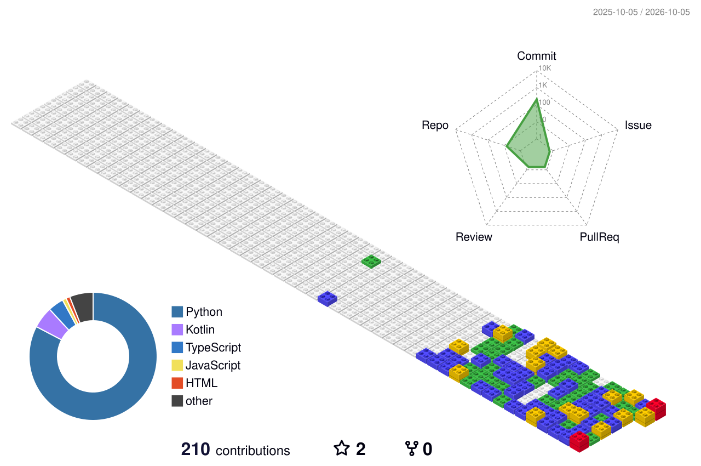

# `ANSHUL DHIMAN`

**Artificial Intelligenece & Machine Learning**

`Machine Learning` · `Deep Learning` · `Computer Vision` · `LLMs`

 

  

<table align="center" style="border-collapse: collapse;">
<tr>
<td align="center" style="padding: 0 20px;">
<a href="https://www.linkedin.com/in/anshul-dhiman-ai/">

</a>
 
<a href="https://www.linkedin.com/in/anshul-dhiman-ai/" style="text-decoration:none;">
<b style="font-size: 16px;">anshul-dhiman-ai</b>
</a>
</td>

<td align="center" style="padding: 0 20px;">
<a href="https://leetcode.com/u/anshul_ai/">

</a>
 
<a href="https://leetcode.com/u/anshul_ai/" style="text-decoration:none;">
<b style="font-size: 16px;">anshul_ai</b>
</a>
</td>

<td align="center" style="padding: 0 20px;">
<a href="https://www.hackerrank.com/profile/anshuldhiman_ml">

</a>
 
<a href="https://www.hackerrank.com/profile/anshuldhiman_ml" style="text-decoration:none;">
<b style="font-size: 16px;">anshuldhiman_ai</b>
</a>
</td>

</tr>
</table>

---

## `01` — ABOUT

<table>
<tr>
<td width="68%" valign="top">

### AI/ML Engineer

I'm **Anshul Dhiman**, a **B.Tech CSE (AI/ML) student** exploring **machine learning, deep learning, and AI systems**.

I build practical AI solutions while continuously developing my **DSA and problem-solving skills**.

 

`B.Tech CSE — AI/ML`  
`2nd Year · 3rd Semester`

</td>
<td width="32%" align="center" valign="middle">

&nbsp;&nbsp;

&nbsp;&nbsp;

  

<b>MACHINE LEARNING · DEEP LEARNING · AI SYSTEMS</b>

</td>
</tr>
</table>

---

## `02` — TECHNOLOGY STACK

### LANGUAGES
<table>
<tr>
<td align="center"> Python</td>
<td width="14"></td>
<td align="center"> C</td>
<td width="14"></td>
<td align="center"> C++</td>
<td width="14"></td>
<td align="center"> JavaScript</td>
<td width="14"></td>
<td align="center"> SQL</td>
</tr>
</table>

### AI / ML & DATA SCIENCE
<table>
<tr>
<td align="center"> NumPy</td>
<td width="14"></td>
<td align="center"> Pandas</td>
<td width="14"></td>
<td align="center"> Scikit-learn</td>
<td width="14"></td>
<td align="center"> TensorFlow</td>
<td width="14"></td>
<td align="center"> PyTorch</td>
</tr>
</table>

### DEVELOPMENT & DATABASES

<table>
<tr>

<td align="center" valign="middle" width="70" height="70">
  
   
  MongoDB
</td>

<td width="14"></td>

<td align="center" valign="middle" width="70" height="70">
  
   
  FastAPI
</td>

<td width="14"></td>

<td align="center" valign="middle" width="70" height="70">
  
   
  React
</td>

<td width="14"></td>

<td align="center" valign="middle" width="70" height="70">
  
   
  Git
</td>

<td width="14"></td>

<td align="center" valign="middle" width="70" height="70">
  
   
  GitHub
</td>

<td width="14"></td>

<td align="center" valign="middle" width="70" height="70">
  
   
  VS Code
</td>

<td width="14"></td>

<td align="center" valign="middle" width="70" height="70">
  
   
  Jupyter
</td>

</tr>
</table>

---

## `03` — AI TOOLS & PLATFORMS

<table>
<tr>

<td align="center" width="140" height="120">
  
  <b>Claude Code</b>
</td>

<td width="20"></td>

<td align="center" width="140" height="120">
  
    
  <b>Antigravity</b>
</td>

<td width="20"></td>

<td align="center" width="140" height="120">
  
    
  <b>Codex</b>
</td>

<td width="20"></td>

<td align="center" width="140" height="120">
  
    
  <b>Devin</b>
</td>

<td width="20"></td>

<td align="center" width="140" height="120">
  
    
  <b>Cursor</b>
</td>

</tr>
</table>

---

## `04` — FEATURED WORK

<table cellspacing="30">
<tr>

<td width="50%" valign="top">

### `01` · BATUA

**Personal Finance Manager for INR**

Local-first expense tracking with NLP, analytics, and budgeting.

 

`Python` · `FastAPI` · `React` · `MongoDB`

 

<a href="https://github.com/anshuldhiman-ai/Batua">
<b>VIEW REPOSITORY →</b>
</a>

</td>

<td width="50%" valign="top">

### `02` · CURRENCY COUNTER

**Real-time Currency Exchange Tool**

Multi-currency converter with live rates and history tracking.

 

`JavaScript` · `HTML` · `CSS`

 

<a href="https://github.com/anshuldhiman-ai/Currency-Counter">
<b>VIEW REPOSITORY →</b>
</a>

</td>

</tr>
</table>

---

## `05` — GITHUB SIGNAL

 

---

## `06` — 3D CONTRIBUTION GRAPH

 

Auto-generated daily by [@yoshi389111/github-profile-3d-contrib](https://github.com/yoshi389111/github-profile-3d-contrib)

---

### BUILDING · LEARNING · SOLVING

 

