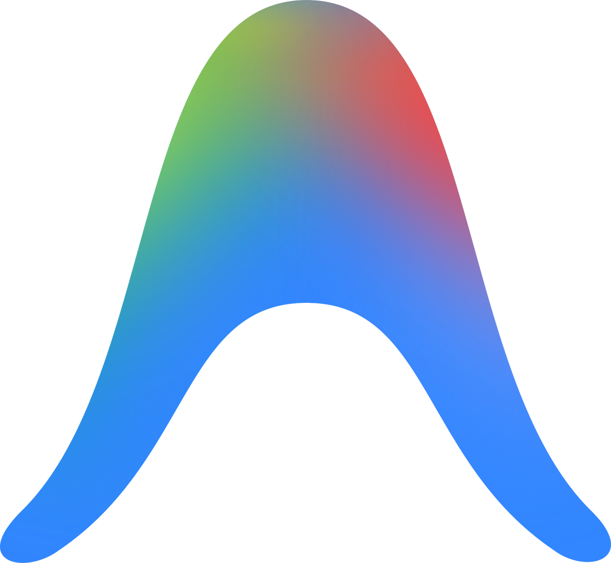

 

  

<table>
<tr>
<td align="center" style="border-radius: 999px; background: rgba(17,24,39,0.92); padding: 12px 30px; border: 1px solid rgba(96,165,250,0.15);">

&nbsp;&nbsp;&nbsp;&nbsp;

&nbsp;&nbsp;&nbsp;&nbsp;

&nbsp;&nbsp;&nbsp;&nbsp;

</td>
</tr>
</table>

---

## `01` — ABOUT

<table>
<tr>
<td width="68%" valign="top">

### AI/ML Engineer

I'm **Anshul Dhiman**, a **B.Tech CSE (AI/ML) student** exploring **machine learning, deep learning, and AI systems**.

I build practical AI solutions while continuously developing my **DSA and problem-solving skills**.

 

`B.Tech CSE — AI/ML`  
`2nd Year · 3rd Semester`

</td>
<td width="32%" align="center" valign="middle">

&nbsp;&nbsp;

&nbsp;&nbsp;

  

<b>MACHINE LEARNING · DEEP LEARNING · AI SYSTEMS</b>

</td>
</tr>
</table>

---

## `02` — TECHNOLOGY STACK

### LANGUAGES
<table>
<tr>
<td align="center"> Python</td>
<td width="14"></td>
<td align="center"> C</td>
<td width="14"></td>
<td align="center"> C++</td>
<td width="14"></td>
<td align="center"> JavaScript</td>
<td width="14"></td>
<td align="center"> SQL</td>
</tr>
</table>

### AI / ML & DATA SCIENCE
<table>
<tr>
<td align="center"> NumPy</td>
<td width="14"></td>
<td align="center"> Pandas</td>
<td width="14"></td>
<td align="center"> Scikit-learn</td>
<td width="14"></td>
<td align="center"> TensorFlow</td>
<td width="14"></td>
<td align="center"> PyTorch</td>
</tr>
</table>

### DEVELOPMENT & DATABASES
<table>
<tr>
<td align="center"> MongoDB</td>
<td width="14"></td>
<td align="center"> FastAPI</td>
<td width="14"></td>
<td align="center"> React</td>
<td width="14"></td>
<td align="center"> Git</td>
<td width="14"></td>
<td align="center"> GitHub</td>
<td width="14"></td>
<td align="center"> VS Code</td>
<td width="14"></td>
<td align="center"> Jupyter</td>
</tr>
</table>

---

## `03` — AI TOOLS & PLATFORMS

<table>
<tr>
<td align="center" width="50" style="border-radius: 14px; background: rgba(17,24,39,0.9); padding: 18px 12px; border: 1px solid rgba(96,165,250,0.15);">
  <b>Claude Code</b>
</td>
<td width="18"></td>
<td align="center" width="150" style="border-radius: 14px; background: rgba(17,24,39,0.9); padding: 18px 12px; border: 1px solid rgba(96,165,250,0.15);">
  <b>Antigravity</b>
</td>
<td width="18"></td>
<td align="center" width="150" style="border-radius: 14px; background: rgba(17,24,39,0.9); padding: 18px 12px; border: 1px solid rgba(96,165,250,0.15);">
  <b>Codex</b>
</td>
<td width="18"></td>
<td align="center" width="150" style="border-radius: 14px; background: rgba(17,24,39,0.9); padding: 18px 12px; border: 1px solid rgba(96,165,250,0.15);">
  <b>Devin</b>
</td>
<td width="18"></td>
<td align="center" width="150" style="border-radius: 14px; background: rgba(17,24,39,0.9); padding: 18px 12px; border: 1px solid rgba(96,165,250,0.15);">
  <b>Cursor</b>
</td>
</tr>
</table>

---

## `04` — FEATURED WORK

<table>
<tr>
<td width="48%" valign="top" style="border-radius: 14px; background: linear-gradient(135deg, #172554 0%, #111827 100%); padding: 24px; box-shadow: 0 8px 32px rgba(96,165,250,0.14); border: 1px solid rgba(148,163,184,0.12);">

### BATUA

**Personal Finance Manager for INR**

Local-first expense tracking with NLP, analytics, and budgeting.

 

<table>
<tr>
<td align="center"></td>
<td align="center"></td>
<td align="center"></td>
<td align="center"></td>
</tr>
</table>

 

<a href="https://github.com/anshuldhiman-ai/Batua"><b>→ VIEW PROJECT</b></a>

</td>
<td width="4%"></td>
<td width="48%" valign="top" style="border-radius: 14px; background: linear-gradient(135deg, #172554 0%, #111827 100%); padding: 24px; box-shadow: 0 8px 32px rgba(96,165,250,0.14); border: 1px solid rgba(148,163,184,0.12);">

### CURRENCY COUNTER

**Real-time Currency Exchange Tool**

Multi-currency converter with live rates and history tracking.

 

<table>
<tr>
<td align="center"></td>
<td align="center"></td>
<td align="center"></td>
</tr>
</table>

 

<a href="https://github.com/anshuldhiman-ai/Currency-Counter"><b>→ VIEW PROJECT</b></a>

</td>
</tr>
</table>

---

## `05` — GITHUB SIGNAL

 

---

## `06` — CODING PROFILES

  

<table>
<tr>

<td align="center" width="220">

 
<a href="https://leetcode.com/u/anshul_ai/"><b>anshul_ai</b></a>
</td>

<td width="40"></td>

<td align="center" width="220">

 
<a href="https://www.hackerrank.com/profile/anshul_dhiman_ml"><b>anshul_dhiman_ml</b></a>
</td>

</tr>
</table>

 

PROBLEM SOLVING · ALGORITHMS · DATA STRUCTURES

---

## `07` — CONTRIBUTION ACTIVITY

---

### BUILDING · LEARNING · SOLVING

 

  

